# Payment-Safe Causal Revenue Recovery Governor

A payment recovery system that combines **financial truth, counterfactual recovery prediction, merchant economics, deterministic policy controls, auditable execution, and payment-linked outcomes** to decide when and how failed payments should be recovered.

The system is designed around a simple principle:

> A recovery action should be taken only when it is operationally safe and expected to create more merchant value than doing nothing.

---

## Table of Contents

- [Overview](#overview)
- [Problem](#problem)
- [Design Principles](#design-principles)
- [Architecture](#architecture)
- [Payment Truth](#payment-truth)
- [Recovery Eligibility](#recovery-eligibility)
- [Decision State](#decision-state)
- [Recovery Actions](#recovery-actions)
- [Machine Learning](#machine-learning)
- [Counterfactual Evaluation](#counterfactual-evaluation)
- [Economic Governor](#economic-governor)
- [Policy Guardrails](#policy-guardrails)
- [Decision Audit](#decision-audit)
- [Execution Safety](#execution-safety)
- [Recovery Outcomes](#recovery-outcomes)
- [Database Architecture](#database-architecture)
- [Evaluation Results](#evaluation-results)
- [Merchant Modes](#merchant-modes)
- [Feature Engineering](#feature-engineering)
- [Temporal Leakage Protection](#temporal-leakage-protection)
- [Model Experiments](#model-experiments)
- [Repository Structure](#repository-structure)
- [Environment](#environment)
- [Installation](#installation)
- [Database Setup](#database-setup)
- [Running the Pipeline](#running-the-pipeline)
- [Testing](#testing)
- [Operational Smoke Test](#operational-smoke-test)
- [Engineering Guarantees](#engineering-guarantees)
- [Known Limitations](#known-limitations)
- [Planned Extensions](#planned-extensions)

---

# Overview

Payment recovery is often framed as a classification problem:

```text
Will this failed payment recover?
```

This project treats recovery as a **decision problem** instead.

For each eligible failed order, the system evaluates several possible interventions and estimates the expected outcome under each one.

Examples include:

```text
NO_ACTION
NUDGE
SWITCH_UPI
SWITCH_CREDIT_CARD
SWITCH_DEBIT_CARD
SWITCH_NETBANKING
OFFER_5
OFFER_10
```

For every candidate action, the system estimates:

```text
Recovery probability
Uplift over NO_ACTION
Expected merchant value
Incremental utility
```

The final action is selected by a deterministic **Recovery Governor** that combines model estimates with merchant economics and safety rules.

---

# Problem

Maximizing recovery rate alone can produce poor recovery policies.

A strategy may recover slightly more payments while also causing:

```text
higher discount spend
more unnecessary customer contact
higher execution cost
greater intervention intensity
lower merchant margin
```

For example, an incentive can increase the probability of recovery while still reducing expected merchant value.

The objective is therefore not:

```text
maximize P(recovery)
```

but:

```text
maximize expected incremental merchant value
subject to payment safety and operational policy
```

---

# Design Principles

The system deliberately separates four responsibilities:

```text
Prediction
    ≠
Policy
    ≠
Execution
    ≠
Financial Truth
```

**Prediction** estimates recovery probability under possible actions.

**Policy** determines whether an action is allowed.

**Execution** records what was actually attempted.

**Financial truth** determines whether payment was ultimately recovered.

This separation prevents model output from becoming an authority over payment state.

---

# Architecture

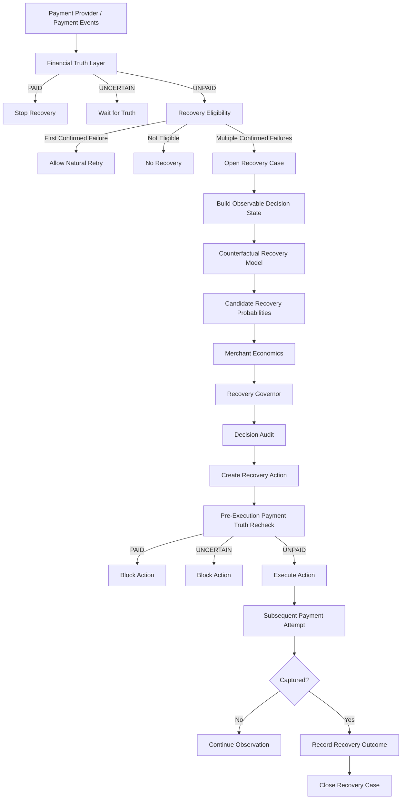

The architecture follows a strict dependency direction:

```text
Financial Truth
    ↓
Eligibility
    ↓
Decision State
    ↓
Prediction
    ↓
Economics
    ↓
Policy
    ↓
Execution
    ↓
Outcome
```

---

# Payment Truth

The payment layer is the authority for financial state.

The recovery model does not infer whether an order is paid.

## PAID

If any payment attempt has a confirmed `CAPTURED` state:

```text
CAPTURED
    ↓
PAID
    ↓
STOP
```

No recovery action should be executed.

## UNCERTAIN

Statuses such as:

```text
CREATED
AUTHORIZED
```

represent unresolved payment state.

The workflow returns:

```text
WAIT_FOR_TRUTH
```

Recovery intervention is withheld until the payment state becomes definitive.

## UNPAID

Only confirmed failure can proceed into recovery eligibility.

---

## Historical Truth

For historical reconstruction, payment truth is calculated using event history as of a specified decision time.

An event is considered known only when:

```text
event_time < decision_time
```

and:

```text
received_at < decision_time
```

This prevents delayed or future events from entering historical decision state.

---

# Recovery Eligibility

Recovery is not opened immediately after the first confirmed failure.

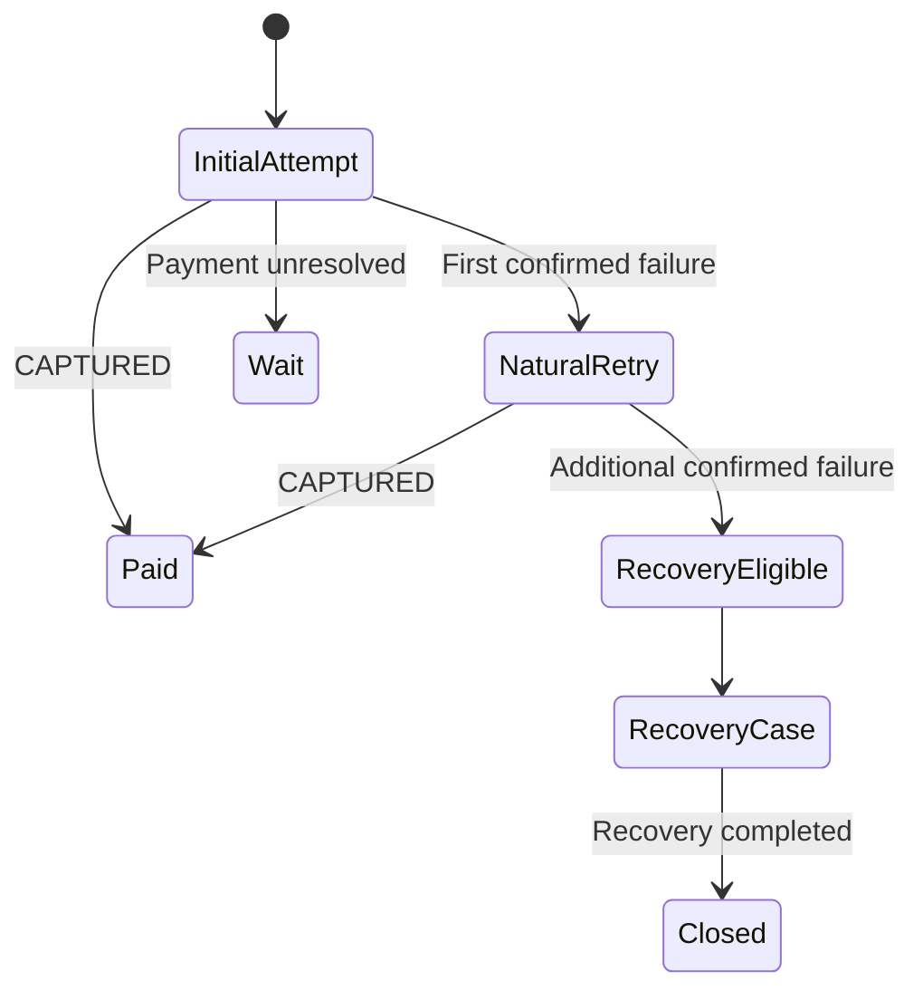

The current eligibility policy includes the following outcomes:

| Condition | Result |
|---|---|
| Order already paid | `ORDER_ALREADY_PAID` |
| Payment state unresolved | `PAYMENT_STATE_UNCERTAIN` |
| No confirmed failure | `NO_CONFIRMED_FAILURE` |
| First confirmed failure | `ALLOW_NATURAL_RETRY` |
| Active recovery case already exists | `RECOVERY_CASE_ALREADY_EXISTS` |
| Multiple confirmed failures | `MULTIPLE_CONFIRMED_FAILURES` |

A partial unique database index ensures that an order cannot have more than one active recovery case.

---

# Decision State

The model receives a production-compatible state built only from observable information.

The state includes information from four groups.

### Current payment state

```text
current payment method
failure category
attempt count
current order amount
```

### Customer history

```text
customer tenure
prior checkout count
prior success count
prior failure count
historical success rate
order amount ratio
```

### Payment-method history

For each supported payment method:

```text
attempt count
success count
success rate
```

Supported methods currently include:

```text
UPI
CREDIT_CARD
DEBIT_CARD
NETBANKING
```

### Runtime signals

```text
contact consent
customer activity
payment-method availability
observed rail health
```

Simulator-only hidden variables are not required by the operational decision path.

---

# Recovery Actions

The current action space is:

| Action | Description |
|---|---|
| `NO_ACTION` | Allow natural recovery |
| `NUDGE` | Send a recovery reminder |
| `SWITCH_UPI` | Recommend UPI |
| `SWITCH_CREDIT_CARD` | Recommend credit card |
| `SWITCH_DEBIT_CARD` | Recommend debit card |
| `SWITCH_NETBANKING` | Recommend netbanking |
| `OFFER_5` | Offer a 5% incentive |
| `OFFER_10` | Offer a 10% incentive |

Candidate generation is structural.

For example:

```text
current method = NETBANKING
```

means:

```text
SWITCH_NETBANKING
```

is excluded because switching to the current payment method has no operational meaning.

---

# Machine Learning

The production recovery model is a pooled **S-Learner**.

The model estimates:

```text
P(recovery | observable state, candidate action)
```

The same decision state is evaluated repeatedly with different candidate actions.

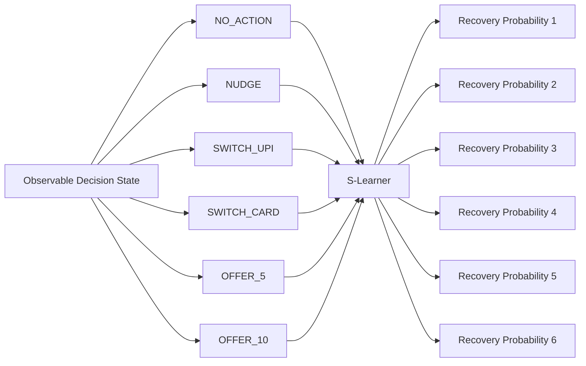

The production model is stored at:

```text
models/s_learner.joblib
```

---

# Counterfactual Evaluation

The project includes a stochastic simulator used as a digital twin for policy evaluation.

For a fixed observable decision state, the simulator can replay the outcome repeatedly under different actions.

Conceptually:

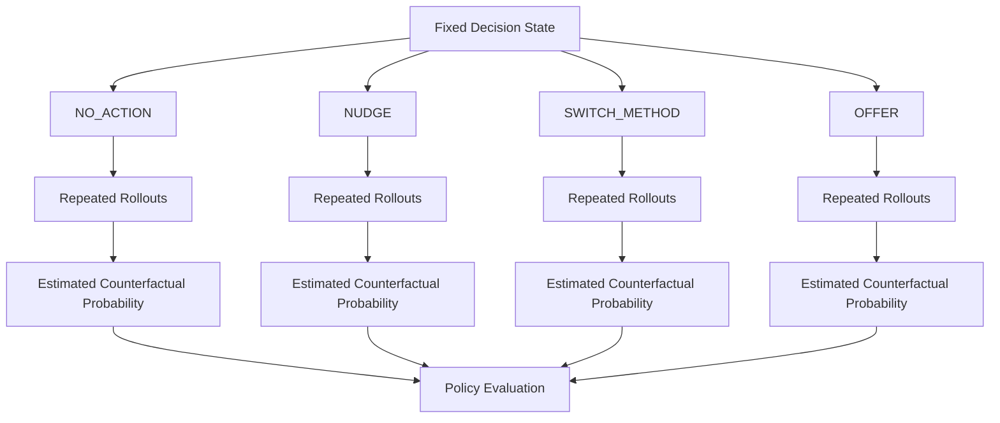

This allows evaluation beyond factual classification accuracy.

Metrics include:

```text
probability MAE
uplift MAE
uplift correlation
best-action accuracy
policy recovery rate
oracle recovery rate
oracle regret
```

The simulator's hidden variables are not exposed to the production model.

---

# Economic Governor

The ML model supplies predicted recovery probabilities.

The Governor converts those probabilities into merchant economics.

For an action:

```text
Expected Merchant Value
=
Expected recovered contribution
-
Expected discount cost
-
Action execution cost
```

Incremental utility is defined as:

```text
Incremental Utility(action)
=
Expected Merchant Value(action)
-
Expected Merchant Value(NO_ACTION)
```

The Governor selects the allowed action with the highest positive incremental utility.

If no intervention produces positive incremental value:

```text
NO_ACTION
```

is selected.

---

## Example Decision

Example operational state:

```text
Current method: NETBANKING
Failure category: TECHNICAL_FAILURE
Attempt count: 2
Prior checkouts: 1
Prior successes: 1
Amount ratio: 1.5
Contact consent: True
Customer active: False
```

Candidate evaluation:

| Action | Predicted Recovery | Expected Merchant Value | Incremental Utility |
|---|---:|---:|---:|
| `NO_ACTION` | 70.91% | ₹372.27 | ₹0.00 |
| `NUDGE` | 72.99% | ₹381.18 | **+₹8.90** |
| `SWITCH_UPI` | 71.96% | ₹377.30 | +₹5.03 |
| `SWITCH_CREDIT_CARD` | 72.65% | ₹380.92 | +₹8.65 |
| `SWITCH_DEBIT_CARD` | 71.96% | ₹377.30 | +₹5.03 |
| `OFFER_5` | 69.18% | ₹311.29 | **-₹60.98** |
| `OFFER_10` | 69.18% | ₹259.41 | **-₹112.86** |

The selected action is:

```text
NUDGE
```

The offer actions remain valid candidates but are economically dominated.

---

# Policy Guardrails

Policy checks are deterministic and external to the model.

They currently include:

```text
maximum payment attempts
contact consent
customer activity
payment-method availability
same-method switching
merchant offer cap
action validity
```

Examples:

```text
contact_consent = false
NUDGE
→ CONTACT_CONSENT_MISSING
```

```text
merchant offer cap = 5%
OFFER_10
→ MERCHANT_OFFER_CAP_EXCEEDED
```

```text
target method unavailable
SWITCH_METHOD
→ TARGET_METHOD_UNAVAILABLE
```

An action can therefore be:

```text
structurally available
policy eligible
economically unattractive
```

These are separate states.

---

# Decision Audit

Every recovery decision is persisted together with its candidate-level evaluation.

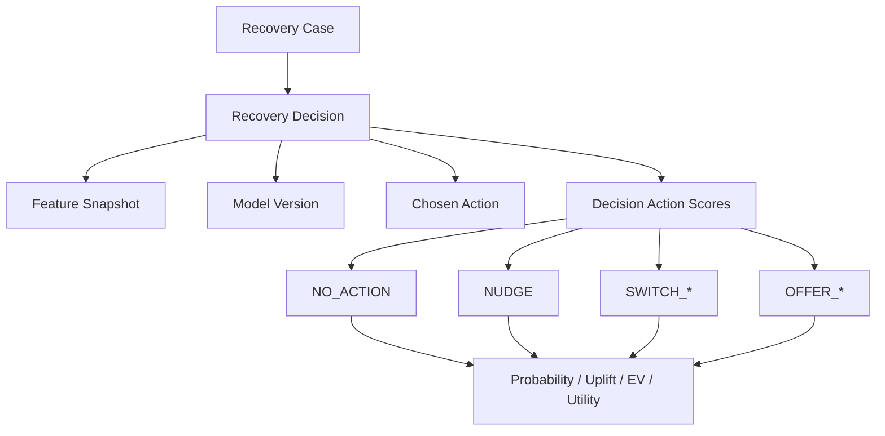

The decision record stores:

```text
decision ID
recovery case ID
prediction time
model version
proposed action
feature snapshot
explanation
```

Each candidate score stores:

```text
action type
policy eligibility
ineligibility reason
predicted recovery probability
uplift
expected incremental utility
payment processing cost
action cost
discount cost
expected merchant value
```

---

## Transactional Persistence

A decision and all of its candidate scores are stored in one PostgreSQL transaction.

```text
BEGIN

INSERT recovery_decision
INSERT candidate score
INSERT candidate score
INSERT candidate score
...

COMMIT
```

If any candidate write fails:

```text
ROLLBACK
```

No partial audit record is retained.

---

# Execution Safety

A selected action does not immediately imply execution.

The selected action first enters:

```text
PENDING
```

Immediately before execution, payment truth is evaluated again.

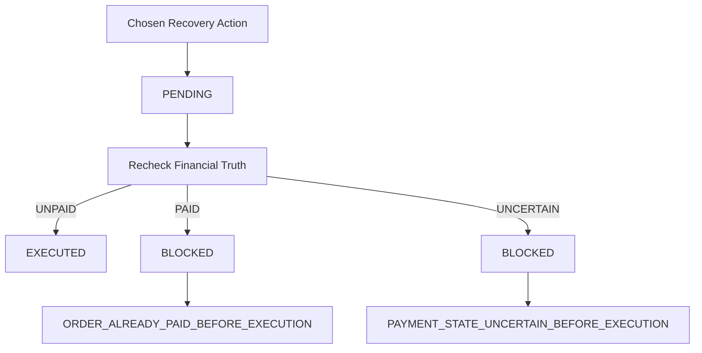

This protects against race conditions where the customer completes payment after a recovery decision has already been created.

The current execution states include:

```text
PENDING
EXECUTED
BLOCKED
NOT_REQUIRED
```

---

# Recovery Outcomes

Execution does not prove recovery.

The following relationship is intentionally invalid:

```text
EXECUTED
→ assume RECOVERED
```

A successful recovery requires a confirmed `CAPTURED` payment.

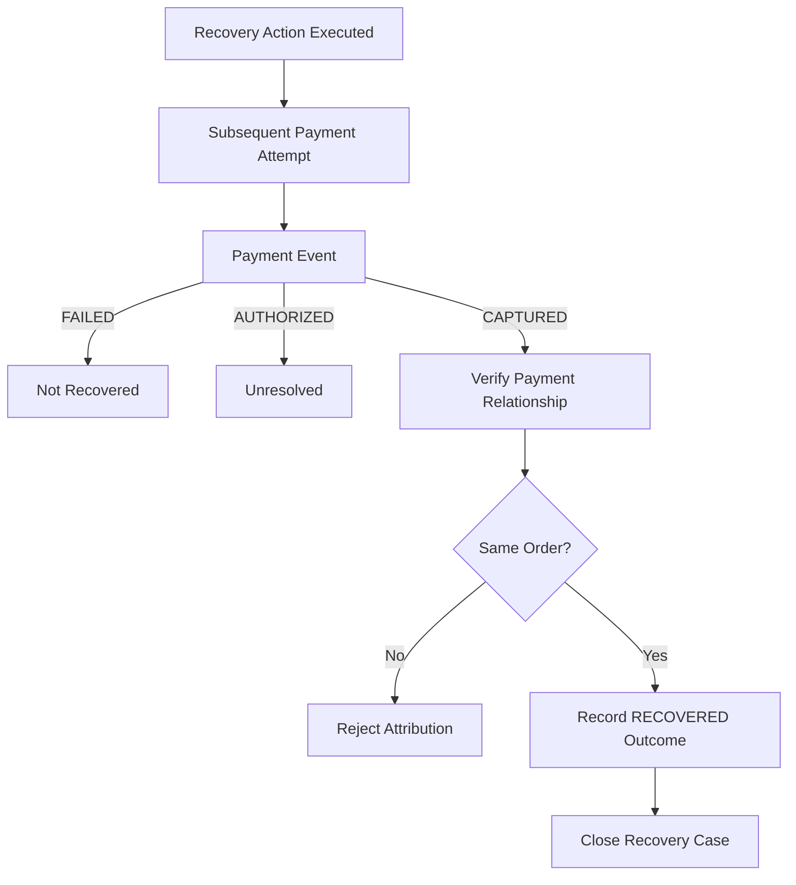

Before recording recovery, the service verifies that:

```text
the payment belongs to the recovery order
the action belongs to the recovery decision
the action was executed
the latest payment event is CAPTURED
```

The recovery case is then closed with:

```text
status = CLOSED
closure_reason = RECOVERED
```

---

# Database Architecture

PostgreSQL stores both operational payment state and recovery audit history.

## Entity Relationship Diagram

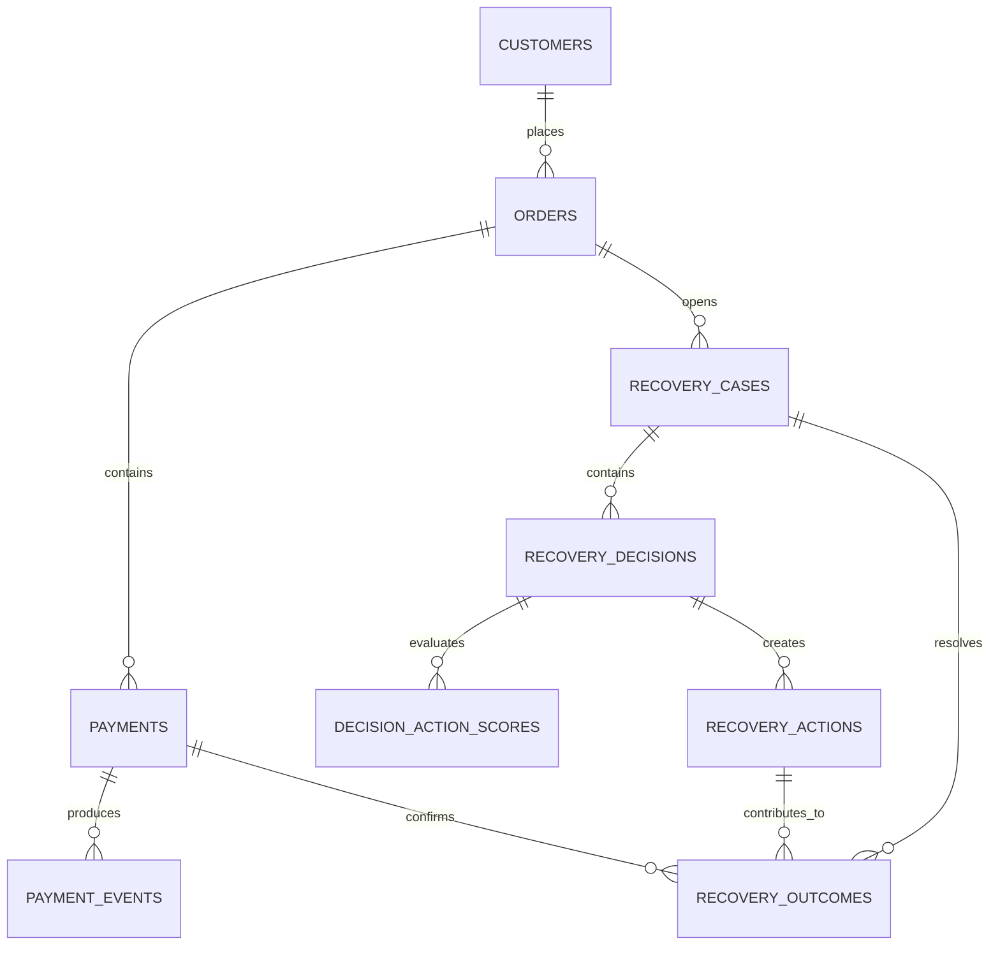

The schema is versioned at:

```text
database/schema.sql
```

---

## Core Tables

| Table | Responsibility |
|---|---|
| `customers` | Customer identity and consent |
| `orders` | Merchant orders |
| `payments` | Payment attempts and materialized state |
| `payment_events` | Timestamped payment-event history |
| `recovery_cases` | Recovery workflow lifecycle |
| `recovery_decisions` | Governor decisions and feature snapshots |
| `decision_action_scores` | Candidate-level model/economic scores |
| `recovery_actions` | Execution state |
| `recovery_outcomes` | Verified payment recovery |

---

## Relational Traceability

A successful recovery is traceable through:

```text
Order
  ↓
Recovery Case
  ↓
Recovery Decision
  ↓
Recovery Action
  ↓
Recovery Outcome
  ↓
Captured Payment
  ↓
Payment Event
```

Example:

```text
Order
O_SMOKE_CURRENT_2dac7042

        ↓

Recovery Case
RC_8b1fb95ab949

status = CLOSED
closure_reason = RECOVERED

        ↓

Decision
D_c93c5e4e554e

model = s_learner_corrected_v1
proposed_action = NUDGE

        ↓

Recovery Action
A_b15cc8bd708e

execution_status = EXECUTED

        ↓

Recovery Outcome
OUT_558070032617

outcome_type = RECOVERED
recovered_amount_minor = 150000

        ↓

Payment
P_SMOKE_RECOVERED_2dac7042

method = NETBANKING
status = CAPTURED

        ↓

Payment Event
CAPTURED
```

---

# Evaluation Results

The economic benchmark compares several recovery policies.

| Strategy | Recovery Rate | Intervention Rate | Unnecessary Intervention Rate | Incremental Value / Failure |
|---|---:|---:|---:|---:|
| `NO_ACTION` | 61.19% | 0.0% | 0.0% | ₹0.00 |
| `BLANKET_NUDGE` | 63.89% | 37.6% | 19.15% | ₹18.00 |
| `RULE_BASED` | 63.13% | 27.2% | 25.00% | ₹13.16 |
| `S_LEARNER_RECOVERY_MAX` | **65.18%** | **83.2%** | **43.27%** | ₹13.17 |
| `ECONOMIC_GOVERNOR` | **65.09%** | **67.6%** | **26.63%** | **₹25.30** |
| `ECONOMIC_ORACLE` | 67.18% | 67.2% | 0.0% | ₹38.33 |

The key comparison is between the recovery-maximizing policy and the economic Governor.

```text
S_LEARNER_RECOVERY_MAX

Recovery rate                  65.18%
Intervention rate              83.20%
Unnecessary intervention       43.27%
Incremental value / failure    ₹13.17
```

```text
ECONOMIC_GOVERNOR

Recovery rate                  65.09%
Intervention rate              67.60%
Unnecessary intervention       26.63%
Incremental value / failure    ₹25.30
```

The economic Governor gives up approximately:

```text
0.09 percentage points
```

of raw recovery rate while substantially reducing intervention intensity and increasing expected incremental merchant value.

---

# Merchant Modes

The Governor supports a minimum incremental-utility threshold.

This controls how aggressively interventions are permitted.

| Mode | Minimum Incremental Utility | Recovery Rate | Intervention Rate | Incremental Value / Failure |
|---|---:|---:|---:|---:|
| **Value Max** | ₹0 | 65.09% | 67.6% | ₹25.30 |
| **Balanced** | ₹5 | 64.33% | 43.6% | ₹22.38 |
| **Conservative** | ₹10 | 63.18% | 26.0% | ₹17.73 |

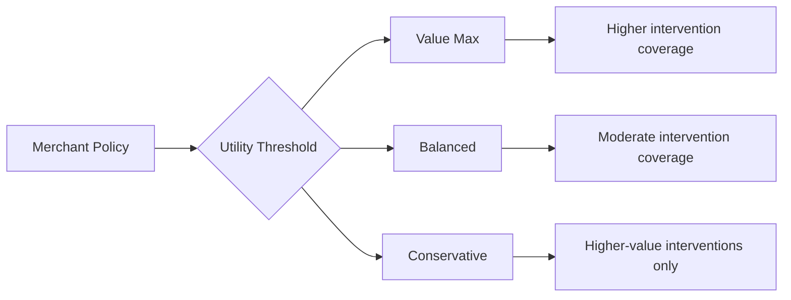

---

# Feature Engineering

The operational feature builder intentionally avoids simulator-only information.

## Historical success and failure

Prior orders are classified as:

```text
successful
failed
uncertain
```

Uncertain history is counted as neither success nor failure.

---

## Payment-method history

The system maintains per-method historical features including:

```text
attempt count
success count
success rate
```

These features were evaluated both as raw historical features and candidate-relative features.

---

## Amount Ratio

The original simulator used a hidden variable representing typical customer order value.

That dependency was removed.

The production-compatible feature is:

```text
current order amount
/
median observed prior order amount
```

When no history exists:

```text
amount_ratio = 1.0
```

---

# Temporal Leakage Protection

The decision builder reconstructs only information that existed before the decision timestamp.

For a decision at time `T`:

```text
payment.created_at < T
event.event_time < T
event.received_at < T
```

Future retries and future payment outcomes are excluded.

Example:

```text
10:00  FAILED
10:15  recovery decision
10:30  CAPTURED
```

At `10:15`, the `10:30` capture is not part of model state.

This applies to:

```text
prior success counts
prior failure counts
payment-method history
payment event state
order history
```

---

# Model Experiments

The repository contains multiple treatment-effect and policy-learning experiments.

Models evaluated include:

```text
S-Learner
T-Learner
IPW S-Learner
Doubly Robust Learner
```

The current production runtime uses the corrected baseline S-Learner.

---

## Raw Payment-Method History Experiment

Twelve additional features were evaluated:

```text
prior_upi_attempt_count
prior_upi_success_count
prior_upi_success_rate

prior_credit_card_attempt_count
prior_credit_card_success_count
prior_credit_card_success_rate

prior_debit_card_attempt_count
prior_debit_card_success_count
prior_debit_card_success_rate

prior_netbanking_attempt_count
prior_netbanking_success_count
prior_netbanking_success_rate
```

The representation improved some counterfactual metrics while degrading others.

It was not promoted to the production model.

---

## Candidate-Relative History Experiment

A candidate-relative representation was also evaluated:

```text
target_method_attempt_count
target_method_success_count
target_method_success_rate
```

The representation improved uplift MAE and correlation slightly but did not improve overall policy performance sufficiently.

The corrected baseline S-Learner therefore remains the runtime model.

---

# Repository Structure

```text
recovery_governer/
│
├── backend/
│   ├── data_access/
│   │   ├── payments.py
│   │   └── recovery.py
│   │
│   ├── services/
│   │   ├── payment_truth.py
│   │   ├── recovery_eligibility.py
│   │   ├── recovery_state.py
│   │   ├── recovery_candidates.py
│   │   ├── recovery_decision.py
│   │   ├── recovery_audit.py
│   │   ├── recovery_execution.py
│   │   ├── recovery_outcome.py
│   │   ├── recovery_engine.py
│   │   └── recovery_factory.py
│   │
│   └── db.py
│
├── database/
│   └── schema.sql
│
├── data/
│   ├── historical_recovery.csv
│   ├── economic_benchmark_summary.csv
│   ├── governor_evaluation.csv
│   ├── governor_threshold_evaluation.csv
│   └── governor_threshold_summary.csv
│
├── ml/
│   ├── features.py
│   ├── action_features.py
│   ├── s_learner.py
│   ├── t_learner.py
│   ├── ipw_s_learner.py
│   └── dr_learner.py
│
├── models/
│   └── s_learner.joblib
│
├── policy/
│   ├── economics.py
│   └── governor.py
│
├── scripts/
│   ├── generate_historical_data.py
│   ├── train_s_learner.py
│   ├── evaluate_counterfactual_models.py
│   ├── evaluate_governor_economics.py
│   ├── evaluate_governor_thresholds.py
│   ├── evaluate_s_feature_experiment.py
│   └── smoke_operational_recovery.py
│
├── simulator/
│   ├── models.py
│   ├── decision_state.py
│   └── historical_dataset.py
│
├── tests/
│
├── .env.example
├── requirements.txt
├── CHECKPOINT.md
└── README.md
```

---

# Environment

The current tested development environment uses:

```text
Python      3.14.7
PostgreSQL  18.x
```

Core Python dependencies:

```text
joblib==1.6.0
numpy==2.5.2
pandas==3.0.5
psycopg==3.3.4
psycopg-binary==3.3.4
pytest==9.1.1
python-dotenv==1.2.3
scikit-learn==1.9.0
```

---

# Installation

## Clone the repository

```bash
git clone <repository-url>
cd recovery_governer
```

## Create a virtual environment

### Windows PowerShell

```powershell
python -m venv .venv
.\.venv\Scripts\Activate.ps1
```

### Linux / macOS

```bash
python -m venv .venv
source .venv/bin/activate
```

## Install dependencies

```bash
pip install -r requirements.txt
```

Verify dependency consistency:

```bash
pip check
```

---

# Database Setup

## Create the database

```sql
CREATE DATABASE razorpay_recovery;
```

## Configure environment variables

Copy:

```text
.env.example
```

to:

```text
.env
```

Example:

```env
PGHOST=localhost
PGPORT=5432
PGDATABASE=razorpay_recovery
PGUSER=postgres
PGPASSWORD=your_postgres_password
```

The actual `.env` file should not be committed.

---

## Restore the schema

If `psql` is available in `PATH`:

```bash
psql -U postgres -d razorpay_recovery -f database/schema.sql
```

On Windows with PostgreSQL 18:

```powershell
& "C:\Program Files\PostgreSQL\18\bin\psql.exe" `
-U postgres `
-d razorpay_recovery `
-f database\schema.sql
```

---

# Running the Pipeline

## Generate historical recovery data

```bash
python -m scripts.generate_historical_data
```

The canonical generated dataset contains approximately:

```text
20,000 decision opportunities
45 columns
```

and is stored at:

```text
data/historical_recovery.csv
```

---

## Train the production S-Learner

```bash
python -m scripts.train_s_learner
```

The runtime model is stored at:

```text
models/s_learner.joblib
```

---

## Counterfactual model evaluation

```bash
python -m scripts.evaluate_counterfactual_models
```

---

## Economic policy benchmark

```bash
python -m scripts.evaluate_governor_economics
```

Generated outputs include:

```text
data/economic_benchmark_summary.csv
data/governor_evaluation.csv
```

---

## Merchant threshold evaluation

```bash
python -m scripts.evaluate_governor_thresholds
```

Generated outputs include:

```text
data/governor_threshold_summary.csv
data/governor_threshold_evaluation.csv
```

---

# Testing

Run the full suite:

```bash
pytest -q
```

The test suite covers:

```text
database access
payment truth
historical truth reconstruction
recovery eligibility
natural retry
temporal leakage
decision-state construction
payment-method history
feature engineering
candidate generation
S-Learner behavior
Governor policy rules
economic decision logic
decision audit
transaction rollback
execution state
pre-execution payment truth checks
payment attribution
recovery outcome recording
case closure
workflow orchestration
```

Tests use unique identifiers rather than fixed permanent database rows so repeated runs do not violate database uniqueness constraints.

---

# Operational Smoke Test

A complete operational path can be exercised with:

```bash
python -m scripts.smoke_operational_recovery
```

The smoke scenario performs the following sequence:

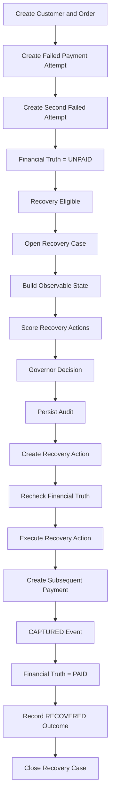

The smoke path uses:

```text
real PostgreSQL persistence
the production S-Learner artifact
the Recovery Governor
decision audit persistence
execution-state persistence
payment-event truth
outcome attribution
case closure
```

---

# Engineering Guarantees

## Payment truth has priority over prediction

```text
PAID
→ no intervention

UNCERTAIN
→ no intervention
```

---

## First failure receives a natural-retry window

```text
first confirmed failure
→ ALLOW_NATURAL_RETRY
```

Recovery intervention begins only after the configured eligibility threshold is satisfied.

---

## Future information is excluded

Historical decision state is reconstructed only from information observable before the decision time.

---

## Decision audit is atomic

The decision header and all candidate scores are persisted together or not persisted at all.

---

## Decision and execution are separate

An approved action may still be blocked before execution.

---

## Payment truth is rechecked immediately before execution

This protects against recovery actions being sent after natural payment completion.

---

## Execution does not imply recovery

Only a confirmed `CAPTURED` payment can create a `RECOVERED` outcome.

---

## Recovery outcomes are relationally linked to payment evidence

The outcome references:

```text
recovery case
recovery action
captured payment
```

through PostgreSQL foreign keys.

---

# Known Limitations

## Training and serving eligibility alignment

The operational recovery workflow requires multiple confirmed failures before opening a recovery case.

A significant portion of the synthetic training population was generated around the first-failure decision opportunity.

The operational safety gate has intentionally not been weakened to match the training population.

A future dataset generation version should align the training decision point exactly with production eligibility.

---

## Payment amount representation

The current `payments` table does not independently store provider-confirmed charged amount.

`recovered_amount_minor` therefore currently represents recovered order value after a confirmed captured payment.

A production payment model should store payment-level financial fields such as:

```text
charged amount
refunded amount
settled amount
currency
processor fee
```

---

## Failure-reason history

`failure_reason` currently exists on the materialized payment row rather than being independently timestamped on every payment event.

Historical replay can therefore reconstruct payment status accurately from events but cannot perfectly reconstruct every historical failure-reason mutation.

---

## Runtime rail-health signals

Payment-method availability and observed rail health are currently supplied as explicit runtime signals.

A production integration would source these from live payment infrastructure telemetry.

---

## Synthetic counterfactual environment

Counterfactual policy evaluation currently relies on the simulator.

Production causal evaluation would require real intervention logging and experimental or quasi-experimental data.

Potential extensions include:

```text
randomized treatment assignment
logged treatment propensity
calibration monitoring
policy drift monitoring
off-policy evaluation
merchant-segment analysis
```

---

# Planned Extensions

The existing recovery engine is structured to support an API and operational observability layer.

The intended service architecture is:

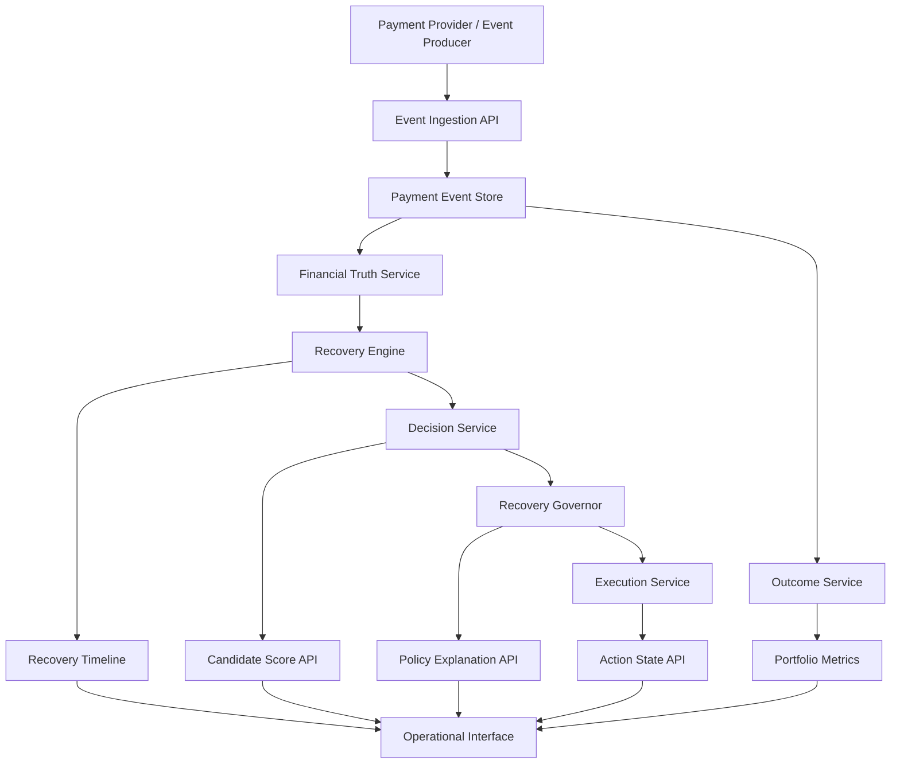

Future service work includes:

```text
FastAPI endpoints
payment-event ingestion
idempotent provider-event processing
live recovery-case timelines
candidate-score endpoints
policy explanation endpoints
merchant policy configuration
portfolio recovery metrics
revenue-at-risk metrics
incremental-value reporting
execution-state monitoring
```

---

# Architecture Summary

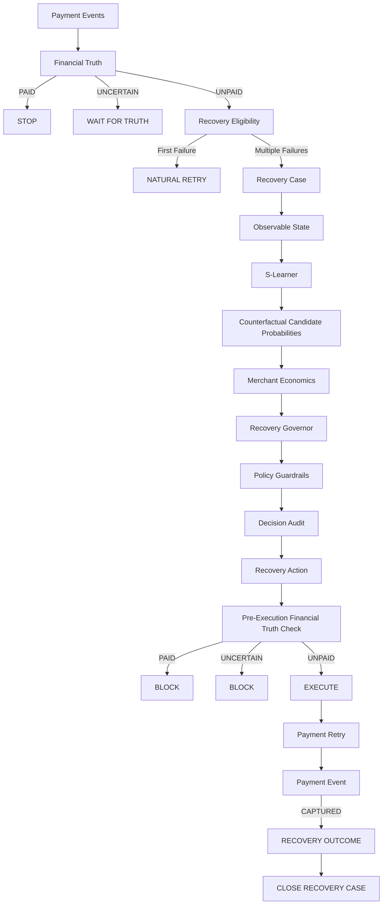

---

# Summary

The system combines:

```text
payment truth
+
time-safe feature reconstruction
+
counterfactual recovery prediction
+
merchant economics
+
deterministic policy
+
transactional audit
+
execution safety
+
payment-linked outcomes
```

to implement a recovery policy whose objective is not simply to increase payment completion, but to increase **justified incremental merchant value** while preserving payment-state correctness.