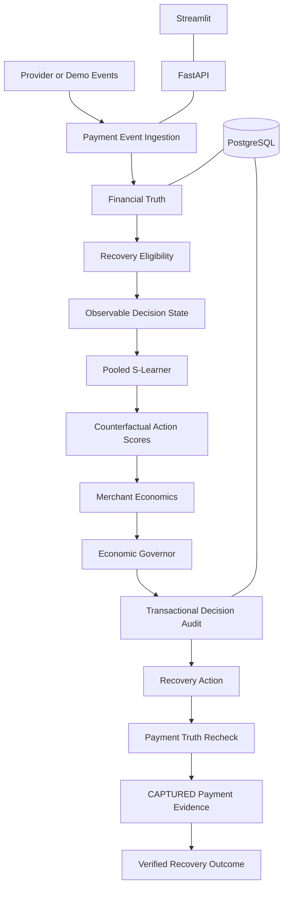

# Recovery Governor

Payment-safe causal revenue recovery that chooses the safe intervention with the highest positive incremental merchant value relative to natural recovery.

Traditional recovery systems often optimize raw recovery probability. Recovery Governor keeps payment evidence, operational policy, prediction, economics, execution, and outcome attribution separate:

```text
Payment Truth
→ Recovery Eligibility
→ Observable Decision State
→ Counterfactual ML
→ Merchant Economics
→ Deterministic Governor
→ Decision Audit
→ Execution
→ Payment-backed Outcome
```

The core principle is simple:

> Recovery Max ≠ Merchant Value Max

## Problem

A failed-looking payment does not automatically justify intervention:

- the customer may recover naturally;
- payment state may still be unresolved;
- retries, messages, and payment-method switches have execution costs;
- discounts can increase recovery while destroying merchant value;
- payment truth may change after a decision; and
- executing an action is not the same as recovering revenue.

The system therefore optimizes expected incremental merchant value—not intervention volume or recovery probability alone—subject to authoritative payment truth and deterministic safety constraints.

## What the system does

For each payment journey, the implemented workflow:

1. Receives and materializes immutable payment-event evidence.
2. Establishes authoritative financial truth: `PAID`, `UNCERTAIN`, or `UNPAID`.
3. Applies deterministic recovery eligibility.
4. Builds a decision-time state from observable information only.
5. Scores every structurally available action with the pooled S-Learner.
6. Calculates expected merchant value relative to `NO_ACTION`.
7. Lets the deterministic Economic Governor select a policy-safe, positive-value action.
8. Persists the decision and every candidate score atomically.
9. Creates and atomically claims the recovery action.
10. Rechecks payment truth immediately before execution.
11. Records recovery only after a linked `CAPTURED` payment event.

**ML predicts. The Governor decides. Payment truth remains authoritative.**

## Architecture



FastAPI provides the application boundary, PostgreSQL stores financial and audit state, and Streamlit reads and operates the system only through the HTTP API.

## AI model

The production champion is a pooled **S-Learner**, stored at [`models/s_learner.joblib`](models/s_learner.joblib). It performs treatment-aware supervised prediction of:

```text
P(recovery | observable state, candidate action)
```

The same observable state is scored under each canonical candidate action:

- `NO_ACTION`
- `NUDGE`
- `SWITCH_UPI`
- `SWITCH_CREDIT_CARD`
- `SWITCH_DEBIT_CARD`
- `SWITCH_NETBANKING`
- `OFFER_5`
- `OFFER_10`

`NO_ACTION` is always the natural-recovery baseline. `WAIT_FOR_TRUTH` is a deterministic workflow state for unresolved payment evidence; it is not an ML treatment.

T-Learner, inverse-propensity-weighted S-Learner, and doubly robust learner implementations remain in the repository as experiments and evaluation approaches. They are not the deployed champion. The Economic Governor is deterministic policy and economics logic, not an AI model.

## Economic Governor

Recovery-Max asks:

> Which action gives the highest recovery probability?

The Economic Governor asks:

> Which safe action creates the highest positive incremental merchant value compared with natural recovery?

For candidate action `a`:

```text
Incremental Utility(a)
= Expected Merchant Value(a)
- Expected Merchant Value(NO_ACTION)
```

If no intervention clears policy constraints and produces positive incremental utility, `NO_ACTION` wins.

### Canonical controlled benchmark

The committed [`data/economic_benchmark_summary.csv`](data/economic_benchmark_summary.csv) reports:

| Strategy | Recovery rate | Intervention rate | Unnecessary intervention | Incremental value / failure |
|---|---:|---:|---:|---:|
| `NO_ACTION` | 61.19% | 0.0% | 0.00% | INR 0.00 |
| `BLANKET_NUDGE` | 63.89% | 37.6% | 19.15% | INR 18.00 |
| `RULE_BASED` | 63.13% | 27.2% | 25.00% | INR 13.16 |
| `S_LEARNER_RECOVERY_MAX` | 65.18% | 83.2% | 43.27% | INR 13.17 |
| `ECONOMIC_GOVERNOR` | 65.09% | 67.6% | 26.63% | INR 25.30 |
| `ECONOMIC_ORACLE` | 67.18% | 67.2% | 0.00% | INR 38.33 |

Compared with Recovery-Max ML, the Economic Governor delivers:

- only **0.09 percentage points** less recovery;
- approximately **1.92×** incremental merchant value per failure;
- **15.6 percentage points** lower intervention; and
- **16.64 percentage points** lower unnecessary intervention.

These are controlled offline evaluation results, not live merchant metrics. `ECONOMIC_ORACLE` is a hindsight upper bound used for regret measurement; it is not a deployable policy.

### Merchant threshold modes

The canonical threshold evaluation exposes policy modes, not separate ML models:

| Mode | Minimum incremental value | Recovery | Intervention | Unnecessary | Incremental value / failure |
|---|---:|---:|---:|---:|---:|
| Value Max (`T=0`) | INR 0 | 65.09% | 67.6% | 26.63% | INR 25.30 |
| Balanced (`T=5`) | INR 5 | 64.33% | 43.6% | 18.35% | INR 22.38 |
| Conservative (`T=10`) | INR 10 | 63.18% | 26.0% | 18.46% | INR 17.73 |

The threshold is the minimum predicted incremental merchant value required before an intervention may be selected.

## Payment-safety invariants

Financial truth always outranks prediction:

```text
CAPTURED → PAID → STOP
CREATED / AUTHORIZED → UNCERTAIN → WAIT_FOR_TRUTH
```

Recovery eligibility remains deliberately conservative:

```text
0 confirmed failures → NO_CONFIRMED_FAILURE
1 confirmed failure  → ALLOW_NATURAL_RETRY
2+ confirmed failures → may become recovery eligible
```

The implementation enforces:

- **One active case per order:** PostgreSQL partial unique index `uq_one_active_recovery_case_per_order`.
- **Idempotent events:** `provider_event_id` is unique; exact redelivery is a safe no-op and conflicting reuse is rejected.
- **Ordered truth:** late or stale events cannot regress terminal `CAPTURED` state.
- **Temporal safety:** historical inputs require `payment.created_at < T`, `event_time < T`, and `received_at < T`.
- **Transactional audit:** feature snapshot, model version, selected action, and every candidate score commit or roll back together.
- **Concurrency-safe action transition:** only one worker can move an action out of `PENDING`.
- **Pre-execution veto:** payment truth is checked again before an intervention executes.
- **Payment-backed attribution:** `RECOVERED` requires relational links to the recovery case, action, payment, and confirmed `CAPTURED` evidence.

Decision does not imply execution. Execution does not imply recovery.

## Product experience

The Streamlit product has five connected pages:

- **Overview** — business value, current persisted recovery activity, and the controlled Governor benchmark.
- **Recovery Lab** — deep inspection of one payment journey, counterfactual candidate matrix, Governor decision, and lifecycle audit.
- **Merchant Ops** — many persisted recovery cases, operational filters, distributions, and order drill-down.
- **Economics & Policy** — controlled strategy benchmarks and merchant utility-threshold tradeoffs.
- **System** — architecture, authority boundaries, model action space, enforced guarantees, and known limitations.

## API

The implemented FastAPI routes are:

| Method | Route | Purpose |
|---|---|---|
| `GET` | `/health` | API, database, and model health |
| `POST` | `/api/payment-events` | Idempotently ingest payment evidence and synchronize payment state |
| `POST` | `/api/demo/scenarios` | Create an explicit deterministic demonstration journey |
| `POST` | `/api/orders/{order_id}/recovery` | Run the recovery workflow for an order |
| `GET` | `/api/orders/{order_id}/recovery` | Read the complete persisted recovery view |
| `GET` | `/api/orders/{order_id}/timeline` | Read the payment and recovery lifecycle timeline |
| `GET` | `/api/recovery-cases` | List persisted recovery cases |
| `GET` | `/api/metrics` | Read operational metrics and canonical benchmark artifacts |
| `POST` | `/api/recovery-cases/{case_id}/outcome` | Attribute a payment-backed recovery outcome |

Interactive OpenAPI documentation is available at `http://127.0.0.1:8000/docs` while FastAPI is running.

## Quickstart

### Prerequisites

- Python 3.14 (the verified environment uses Python 3.14.7)
- PostgreSQL 18 (the tracked schema was exported from PostgreSQL 18.6)
- `psql` available in `PATH`, or the full path to the PostgreSQL client

Run all commands from the repository root.

### 1. Clone and create an environment

```bash
git clone <repository-url>
cd recovery_governer
python -m venv .venv
```

Activate it:

```powershell
# Windows PowerShell
.\.venv\Scripts\Activate.ps1
```

```bash
# Linux / macOS
source .venv/bin/activate
```

Install the pinned dependencies:

```bash
python -m pip install -r requirements.txt
python -m pip check
```

### 2. Configure PostgreSQL

Create the database:

```sql
CREATE DATABASE razorpay_recovery;
```

Copy the environment template and replace its placeholders with local credentials:

```powershell
# Windows PowerShell
Copy-Item .env.example .env
```

```bash
# Linux / macOS
cp .env.example .env
```

Initialize the schema:

```bash
psql -U postgres -d razorpay_recovery -f database/schema.sql
```

### 3. Start the applications

In one terminal:

```bash
python -m uvicorn backend.api.main:app --host 127.0.0.1 --port 8000
```

In another terminal:

```bash
python -m streamlit run dashboard/app.py --server.port 8501
```

Open:

- Streamlit UI: `http://127.0.0.1:8501`
- FastAPI: `http://127.0.0.1:8000`
- Swagger UI: `http://127.0.0.1:8000/docs`

The dashboard uses `RECOVERY_API_BASE_URL` from `.env` and otherwise defaults to `http://127.0.0.1:8000`.

## Project structure

```text
backend/
  api/          FastAPI routes, schemas, application boundary, read models
  data_access/  PostgreSQL persistence and transactional state transitions
  services/     payment truth, eligibility, decision, audit, execution, outcome
dashboard/      Streamlit application, pages, navigation, and shared visual language
ml/             production and experimental causal learners and feature pipelines
models/         tracked trained model artifacts
policy/         merchant economics and deterministic Recovery Governor
simulator/      synthetic journeys and counterfactual outcome environment
scripts/        dataset, training, evaluation, inspection, and smoke commands
data/           canonical dataset and benchmark artifacts
database/       reproducible PostgreSQL schema
tests/          unit, integration, transactional, concurrency, API, and UI helpers
```

## Testing

The final verified repository suite is:

```text
231 passed, 1 existing dependency deprecation warning
```

Run it with:

```bash
python -m compileall -q backend ml policy simulator scripts tests dashboard
python -m pytest -q
```

Coverage includes payment truth, event ingestion and idempotency, event ordering, temporal safety, eligibility and natural retry, counterfactual prediction, Governor economics, workflow-failure preservation, transactional audit, concurrency, API behavior, dashboard helpers, and payment-backed outcome attribution.

An end-to-end operational smoke is also available:

```bash
python -m scripts.smoke_operational_recovery
```

It uses PostgreSQL, the tracked production model, the real Governor, decision audit persistence, execution-state transitions, payment-event truth, outcome attribution, and case closure.

## Provider boundary

The recovery core is provider-agnostic. Production payment-provider webhooks can be adapted into the hardened payment-event ingestion contract.

Provider-specific webhook adapters, provider test modes, and live payment-provider integrations are outside the current implementation.

## Known limitations and production hardening

- **Training/serving alignment:** much of the synthetic training population was generated closer to the first-failure decision point, while operational eligibility requires multiple confirmed failures. The safety gate is intentionally unchanged.
- **Historical failure-reason replay:** event history reconstructs payment status at decision time, but `failure_reason` is materialized on the payment row and cannot be replayed perfectly across mutations.
- **Runtime signal sourcing:** payment-method availability, observed rail health, and customer activity must come from provider or application infrastructure in a production integration.
- **Payment accounting:** recovered value currently represents captured order value, not independently verified settlement value with fees, refunds, and net settlement.
- **External side effects:** payment-state and audit guarantees are implemented. Before connecting irreversible external messaging or provider side effects, execution should move behind a transactional claim/outbox boundary with an explicit lock-order design to fully close the payment-versus-action race.
- **Causal validation:** benchmark results use the synthetic counterfactual environment. Production evaluation requires logged interventions and experimental or defensible quasi-experimental data.

## Repository artifacts

The runtime and evaluation paths depend on these tracked canonical assets:

- [`models/s_learner.joblib`](models/s_learner.joblib) — production S-Learner artifact
- [`data/historical_recovery.csv`](data/historical_recovery.csv) — canonical historical training dataset
- [`data/economic_benchmark_summary.csv`](data/economic_benchmark_summary.csv) — policy comparison summary
- [`data/governor_evaluation.csv`](data/governor_evaluation.csv) — detailed Governor evaluation
- [`data/governor_threshold_summary.csv`](data/governor_threshold_summary.csv) — merchant threshold summary
- [`data/governor_threshold_evaluation.csv`](data/governor_threshold_evaluation.csv) — detailed threshold evaluation
- [`database/schema.sql`](database/schema.sql) — reproducible PostgreSQL schema

The public repository contains no real credentials. Copy [`.env.example`](.env.example) to an ignored `.env` file and supply local values before running the applications.
